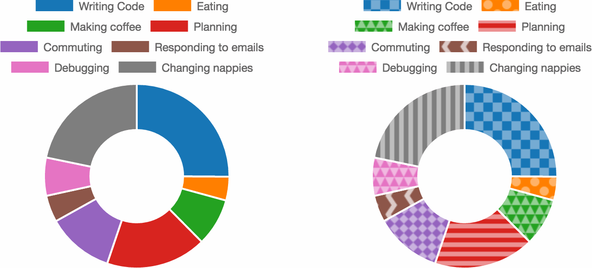
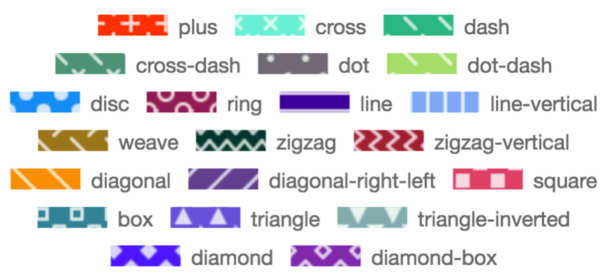

# Patternomaly

Easily generate patterns for use in data graphics.



## But why?

[Color-blindness](http://betweentwobrackets.com/data-graphics-and-colour-vision/), that's why.

This library came about as part of [an issue in Chart.js](https://github.com/chartjs/Chart.js/issues/1323).

## Usage

    npm install patternomaly

Generate a single canvas pattern

    pattern.draw('square', '#1f77b4');

Generate an array of canvas patterns

```javascript
pattern.generate([
  '#1f77b4',
  '#ff7f0e',
  '#2ca02c',
  '#d62728'
]);
```

## Available Patterns

There are currently 21 pattern variants available. When using the `generate` method (above) patterns will be 'randomly' assigned.

It is however possible to provide specific patterns using the `draw` method.

```javascript
datasets: [{
  data: [
    300, 50, 100, 210, 140
  ],
  backgroundColor: [
    pattern.draw('square', '#1f77b4'),
    pattern.draw('circle', '#ff7f0e'),
    pattern.draw('diamond', '#2ca02c'),
    pattern.draw('zigzag-horizontal', '#17becf'),
    pattern.draw('triangle', 'rgb(255, 99, 132, 0.4)') // with opacity
  ]
}]
```

### Pattern Keys

- plus
- cross
- dash
- cross-dash
- dot
- dot-dash
- disc
- ring
- line
- line-vertical
- weave
- zigzag
- zigzag-vertical
- diagonal
- diagonal-right-left
- square
- box
- triangle
- triangle-inverted
- diamond
- diamond-box



*Thanks to [obedm503](https://github.com/obedm503) for generating the example pattern image.*

## Providing a Pattern Alternative

In order to provide an alternative view for visually impaired viewers it's a good idea to [provide a patterned alternative](http://betweentwobrackets.com/data-graphics-and-colour-vision/#patternstotherescue).

See the [pattern option example page](examples/optional.html) for a simple implementation of a pattern toggle switch for Chart.js.

## Typescript / Angular
A typings file is included in this package. Just insert `import {draw, generate} from 'patternomaly'` in the header of your .ts file.
Still you have to add the javascript file to your build e.g. in the scripts array in angular.cli.json e.g.   `"scripts": ["node_modules/patternomaly/dist/patternomaly.js"]`.


